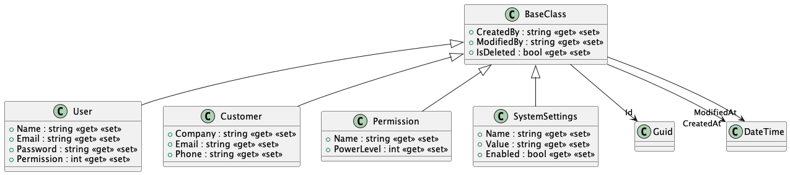
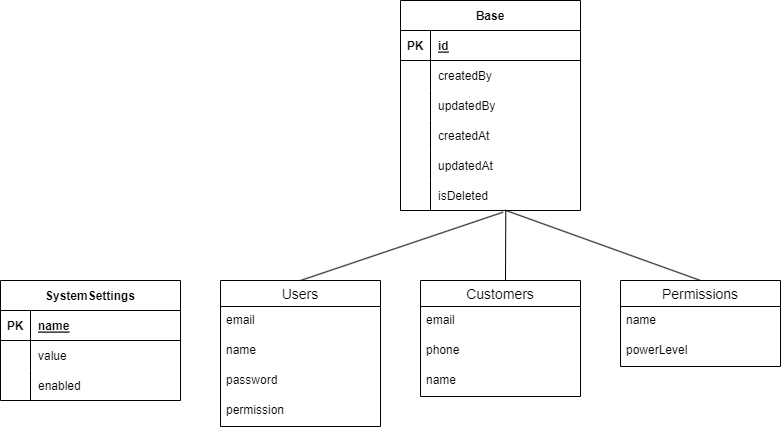

# OpenCMS Design Documentation

## Introduction

The purpose of this application is to allow The Company to securely manage customer contact information in a centralized location. The application must be able to generate reports, validate input, have a user-friendly GUI, and include search functionality. This application is critical to The Company's market expansion. The Company currently uses segregated spreadsheets for each sales representative that contain all of the contact information for their clients, and The Company wants this information to be centralized so that it is easily dispersed.

## System Overview

The system is designed as a web application utilizing the React Production Framework Next.JS. Next.JS handles the client application as well as the api's for handling and manipulating data. The application will write to a MySQL database which has a schema identical to the one shown in the diagrams section.

## User Requirements

When designing the application we had non-technical users in mind from start to finish. The application is meant to be easy to use, and user friendly. The application is also written in an efficient way to minimize system load during use. The application should be able to scale to different screen sizes, as well as include search functionality.

## Functional Requirements

The application must be entirely secure. No information should be able to be exposed without proper credentials. The application must support Create, Read, Update, and Delete operations on all data. The application must perform input validation on both the client side, and server side. The application should also be able to generate reports to show who on the sales team is getting the most new clients.

## Architectural Strategy

This application was designed around the event sourcing architecture. The application is meant to be nearly 100% data driven. The only static content are the registration, sign in, panel, and home pages. Any page that has data on it (i.e user/customer management) is entirely data driven, meaning that the page will automatically refresh as changes are made to the dataset loaded on the page.

## Diagrams

